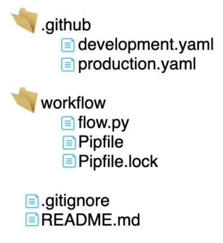

# dataflow-sample-workflow

Sample repository to deploy workflow(s) using the infrastructure from [dataflow-automation-infra](https://github.com/maikelpenz/dataflow-automation-infra)

 

## Steps to configure a *workflow* repository

### 1 - Github: Create repository and configure secrets

The first step is to configure secret variables so the Github pipeline can connect to AWS and Prefect Cloud.

- Using a web browser, go to your Github account and create a new repository
- Enter your repository on Github. On the top menu, click on `Settings`
- One the left side menu click on `Secrets`
- Create the following 3 secrets to give Github access to your AWS account and Prefect Cloud:

AWS_ACCESS_KEY_ID: < aws access key >  
AWS_SECRET_ACCESS_KEY: < aws secret access key >  
PREFECT_WORKFLOW_REGISTER_TOKEN: < prefect cloud api token >  

instructions to create the above secrets can be found on *dataflow-automation-infra*'s README file:  
 *step 1a* = AWS  
 *setp 2*  = Prefect Cloud

 

### 2 - Github: Clone your repository locally

Clone the repository created on step 1 following instructions [from this link](https://docs.github.com/en/github/creating-cloning-and-archiving-repositories/cloning-a-repository)

 

### 3 - Create a branch and add repository files

You can configure your repository in multiple ways. The two resources absolutely required are:

- *.github/workflows*: contains the repository pipeline
- < folder that holds your workflow >: e.g `workflow`

This is an example of repository structure:

### 4 - Github Actions pipeline configuration

The pipeline uses the *custom github action* created on *dataflow-automation-infra*: 
`maikelpenz/dataflow-automation-infra/prefect_setup/prefect_register@github_action_prod`

You can reference `.github/workflows/develop.yaml` and `.github/workflows/prod.yaml` on this repository for the complete set up. These are the *custom action* inputs:

| variable                        | Required  |  Description                                            |  Example                                          |
| --------------------------------| --------- | --------------------------------------------------------| --------------------------------------------------|
| env                             |     Y     | environment to register the workflow                    |    dev                                            |
| git_url                         |     Y     | url of workflow Git repository (this repository)        |    < your repo url>                               |
| branch_name                     |     Y     | branch name you are working on (dev), or master (prod)  |    ${{ steps.action_vars.outputs.branch_name }}   |
| commit_sha                      |     Y     | commit sha from last push                               |    ${{ steps.action_vars.outputs.commit_sha }}    |
| workflow_path                   |     Y     | path to the workflow folder inside the repository       |    workflow                                       |
| prefect_workflow_register_token |     Y     | Prefect Cloud register token from Github secrets        |    ${{ secrets.PREFECT_WORKFLOW_REGISTER_TOKEN }} |
| prefect_execution_environment   |     Y     | Where to run workflow. E.g: *ecs_fargate*               |    ecs_fargate                                    |
| workflow_cpu_configuration      |     Y     | how much cpu required to run workflow                   |    512                                            |
| workflow_memory_configuration   |     Y     | how much memory required to run workflow                |    1024                                           |